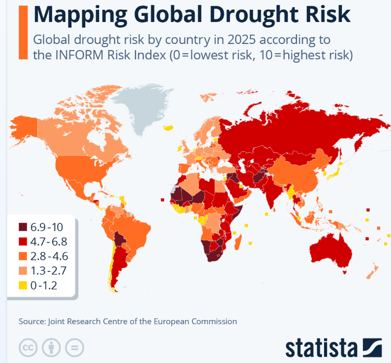

```{r setup, include=FALSE}
knitr::opts_chunk$set(echo = FALSE)
```

1. Set Up Your Course Blog

Welcome to my first blog. In this post, I started by setting up my LIS4317
course blog.

2. First Blog Post: Select & Analyze a Visualization

Here is a visualization of a global population addressing global drought risks
using index score legends to indicate the level of risk.



Fleck, A. (2025). Mapping Global Drought Risk [Image]. Statista. <https://www.statista.com/chart/25101/countries-by-drought-risk/>


According to the data visualization, I believe that it was created by a human 
designer and not generated by AI. My reasoning behind this is that in the
website source, there is an author name, along with a publishing date, author 
email, website name, and a source name in the image, which are attributes that 
belong to a human designer. I also recognize that the decimal scales for each 
level of the drought risk are specific and that there could still be some bias 
found. The only ways this visualization could be created by AI was if the human
designer tried to use some guided information from the AI to structure the image
properly or if they had an AI reference link.


3. Readings

I have successfully visited the required chapters to read that were listed in
this assignment.

4. Syllabus Review

After thoroughly reviewing the syllabus, I confirm that I understand all crucial
information specified on it, especially the course structure, grading, and peer-
review process. When I read the course description, I started to look forward to
use certain platforms that we'll focus on in this class, such as Tableu, Plotly,
Google Sheets, open-source R, and Python. I also got to have a really close look
at the course topics, and I found it interesting that most of the topics listed
have a connection to statistics. I also fully understand the grading breakdown,
policies, and student learning outcomes.


