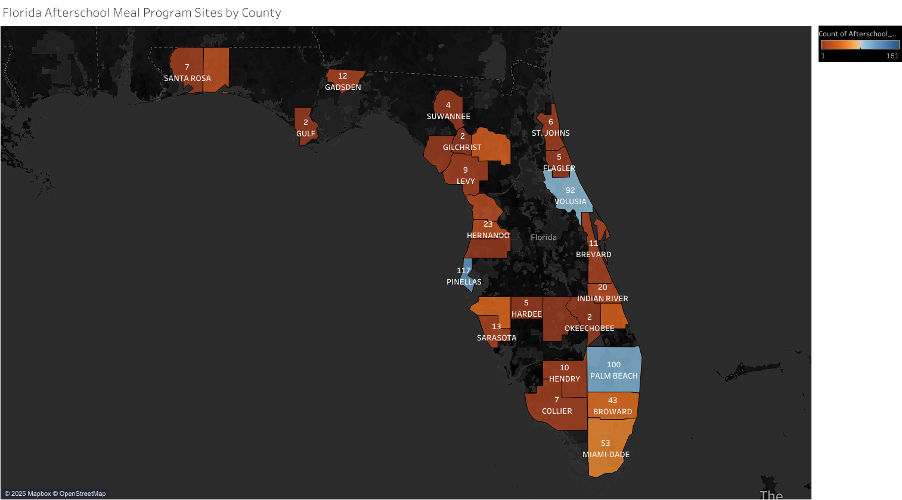

```{r setup, include=FALSE}
knitr::opts_chunk$set(echo = FALSE)
```

1.  Find a dataset with Addresses.

For this week's assignment, I went to Google Dataset Search to find a dataset that I can create a geographic map visualization from using the Tableau Public Desktop Application. I entered these keywords into the search bar: "Florida food access location addresses." The keywords interested me because access to food is a significant issue in the state of Florida. I found the following dataset to be very complete and accurate, and it included a column with full addresses:

<https://hub.arcgis.com/datasets/c0c7a78df6a7468f81ff705e5bbcf8dc_0/explore?location=27.763960%2C-83.741355%2C7.12>

I plan to use this data to create a visualization that shows which counties in Florida are doing a good job of providing access to food and which counties need improvement.

2.  Save to Google Drive

Next, I had to download the .csv file, save it to my Google Drive, and then open it in Google Sheets.

<https://docs.google.com/spreadsheets/d/1VibZa5VExkB_CepFfdOKi2qTl939d6ARQ9gqqLZNLmc/edit?usp=sharing>

3 & 4. Install Tableau Public, Connect Data in Tableau

I downloaded and installed Tableau Public, and linked it to my Google Drive.

5 & 6. Build the Geographic Map, Export Map Image as .png file

I used the dataset columns that Tableau recognized as geographic data types, such as county and zipcode to create a geovisualization that outlines the counties border lines and I was able to map a count variable to each county and label them accordingly. This allowed me to visualize which counties in Florida are doing a good job of providing access to food and which counties need improvement. 

Here is the map:

[{width="100%"}](Sheet1.png)

7. Publish to the Blog

I was able to create a new blog post with the image, and provide a link to my data source in Google Sheets.

There were some challenges that I faced. The first challenge was finding a dataset that had the right number of rows and columns. I needed a dataset that would not be too short on data nor have too much data. I solved this challenge by evaluating the record count when I enter the dataset and try to get enough results from the keywords that I typed. Another challenge that I faced was being able to choose which table names I wanted as my color and detail marks. Some table names convey visualized meaning out of the map while others might make the map appear strange. The solution to this was thinking about which variables I wanted to be illustrated, such as the afterschool count and the county site count.

8. Reflect on Visual Grammar

There are many additional graphic elements or Gestalt principles that I applied to improve clarity and insight:

Point size and color scales are helpful because they can help me to visually represent data attributes. In my map, I used warm colors such as brown and orange to indicate a bad value for a county and represent less Florida afterschool meal program sites, whereas the cool colors such as light blue and dark blue are used to indicate a good value for a county and represents a lot of Florida afterschool meal program sites. Rather than using little points to mark certain locations, I used a filled map that would replace little points with larger filled-in color coded counties and their boundaries to make it easier to outline the space that has more or less of Florida afterschool meal program sites.

Adding text labels and tool tips are very helpful because they can help reveal details on every space of data and provide contextual information. Whether it is explaining what symbols mean or providing more specific data, these features can help improve any map that is created. I gave my counties labels so that the audience would know where the data for each county would be located and a numeric value for the number of programs. The labels are easy to read with a font color of white because the background color of my map is "dark."

Proximity and similarity group patterns are helpful Gestalt principles for creating effective maps by arranging information into groups that are easy to understand and interpret. It can help reduce clutter, make the message of the map more clear, and make for more interesting results. The patterns show the counties that are doing a good job being close to larger cities and the pattern of counties that need more improvement appear to be in less populated rural areas.

