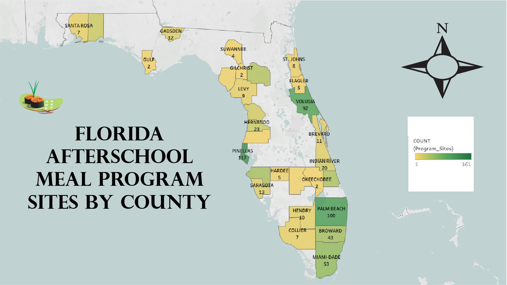

```{r setup, include=FALSE}
knitr::opts_chunk$set(echo = FALSE)
```

1.  Set Up Your Illustrator Canvas

I opened Adobe Illustrator and created a new file, and set an appropriate ratio.

2.  Import Your Data Graphic

I opened my Module 2 map file in Illustrator, and then positioned and scaled it to fit the artboard.

3.  Convert to Vector & Apply Color

I was able to vectorize the map image I placed, ungrouped the traced elements, used the Swatches panel to apply a thoughtful color palette, and then edited my vector elements.

4.  Enhance with Labels & Legends

I used the Type tool to add clear labels, created a legend that explains my color scale and symbols, and applied Gestalt principles.

5.  Export & Publish

I saved my file, exported it as a high-resolution PNG, and I have the right title name for this blog post.

Here is the map that I made changes to on Adobe Illustrator:

[{width="1000"}](mod3.png)

Reflect on Your Design

My map uses a sequential color scheme with a color scale that goes from light to dark, which is very effective for showing data that has a natural order for the afterschool meal program counts. The lighter shades (yellow, light green) indicate counties with fewer afterschool meal program sites, while the darker shades (green, dark green) indicate counties with more afterschool meal sites. I realized from the previous map that some cultures may not view the map scale the same way I would. Others might think orange means good and blue means bad. What makes the warmest color (yellow) on this map better than the other one (orange) is that it indicates rather than a county with a warmer color being bad, the warmer color just means that the county needs improvement. Additionally, my new map's background has more light compared to the last one that was dark. I can see the blue color of the ocean and the gulf better, and the white color is very appropriate for showing the land, whereas the black/dark grey is contrasting the view of the land.

There were many vector elements that I added to this map. I have a compass symbol that represents my map's position and orientation very well. I have a legend that I added below the compass to explain the color gradient used on the map. I have a large title to the left of the map that clearly states the map's purpose, and it has a font style that is approachable and readable. The sushi icon is very nice on this map because the theme of this map is connected to meal programs. Finally, I added the names of the Florida counties each with their own number of program sites because I knew that most geographic maps would need text labels.

Gestalt principles really helped me guide my layout and grouping. Gestalt's principle of Proximity really connects to this map, as the map's layout uses proximity to group elements that are in common with each other. The title, compass, and legend are all placed near the main map of Florida, which means they are all a part of the same visual. Another principle that connects to this map is Figure/Ground. The map uses this principle to distinguish the important data from the background. The state of Florida is the figure, and it is layered against a white ground.
