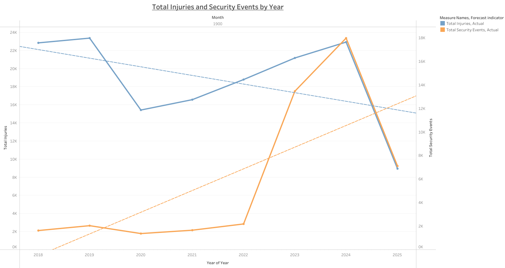

```{r setup, include=FALSE}
knitr::opts_chunk$set(echo = FALSE)
```

1.  Download the Dataset

I used the Monthly Modal Time Series dataset that contained 12 variables

2.  Prepare Your Data

After opening the dataset and reviewing the provided variables, I selected at least six variables: Year, Month, Vehicle Revenue Miles, Vehicle Revenue Hours, Total Security Events, and Total Injuries.

3.  Create Your Visualization

I uploaded my clean dataset to Tableau Public and designed a time series visualization.

4.  Share You Work

I have successfully published my finished visualization on Tableau Public.

Here is a direct link to my Tableau visualization.

<https://public.tableau.com/views/Time_Series_Visualization/Sheet1?:language=en-US&publish=yes&:sid=&:redirect=auth&:display_count=n&:origin=viz_share_link>

Here is an image:



The six variables I selected are: Year, Month, Vehicle Revenue Miles, Vehicle Revenue Hours, Total Security Events, and Total Injuries. I chose the year and month variables because I can use them as time series data points to analyze trends. I chose vehicle revenue hours and vehicle revenue miles variables to measure the total time vehicles are in service and the total distance traveled by all vehicles when they are in service. Finally, I chose total security events and total injuries variables to track patterns in security-related incidents over time and analyze the total number of injuries over time.

The time series visualization I created shows an inverse relationship between the total number of security events and the total number of injuries over time. Specifically, as the total security events with an orange color legend show an increasing trend, the total injuries in a blue color legend display a decreasing trend. This suggests that a higher frequency of security events is associated with a decline in injuries. However, it is worth noting that there is a possible inaccuracy in the exact lines, mainly for the year 2025, which has an incomplete data point. Therefore, while there is a strong connection between security measures and injury prevention, the final year should be viewed with caution, as it is still a misleading figure in the data. The actual lines show that as the total number of injuries increases, so does the total number of security events. The exact lines are completely accurate because it is always important to take proper security measures in the case of an injury or to prevent injury.
