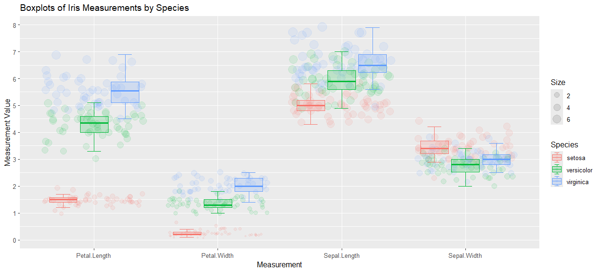

```{r setup, include=FALSE}
knitr::opts_chunk$set(echo = FALSE)
```

1.  Follow the video and PowerPoint tutorial to create a basic chart in R using RStudio.

I followed the video and PowerPoint tutorial on creating a basic chart in R using RStudio.

2.  Use either your own data or one of the sample datasets included in base R (e.g., mtcars, iris, airquality).

I chose Iris as my dataset

3.  Design a chart that highlights either: A comparison across variables (spotting differences), or A divergence from a norm, mean, or baseline (deviation analysis).

I chose to do a comparison across variables spotting differences. The chart also explores divergence from a norm, mean, or baseline deviation analysis.

4.  Export or screenshot your plot, then post it on your blog.

Here is the PNG image file for my plot:

[](SW_LIS4317mod6.png)

5. In your blog post, reflect on the following:
What kind of chart did you create?

Did your visualization reveal any differences between groups or variables?

Did it reveal any deviations from an expected value or benchmark?

How well does your chart align (or not align) with the principles discussed by Few (Chapter 9) and Yau (Chapter 7)?

What challenges did you face in interpreting the visual output?

I created a box-and-whisker plot that deals with a categorical variable called "Measurement" on the x-axis, and a quantitative variable called "Measurement Value" on the y-axis. This type of chart can summarize the distribution of the quantitative data, which in my case is Measurements, for each category. They show the median, quartiles, and the range of the data. I used the Iris dataset in this visualization to identify the variance in size of the length and width of petals and sepals, and to compare the medians of different flower species: setosa, versicolor, and virginica. As I explored the dataset, I was able to compare measurement values across other variables. My box-and-whisker plot revealed that the setosa has smaller measurements than the versicolor and virginica, except for the sepal width, where the setosa values are greater than both of the other two species. The plot also revealed that there is a lot more variance in petal length than in sepal width. The petal length ranges from 1-7 variation units, whereas the sepal width only ranges from 2-4.5 variation units. Likewise, there is a lot more variance in sepal length than there is in petal width.

The chart that I chose aligned very well with the principles discussed in the books. According to Yau (2011), "A quartile is one of three points in a dataset, which marks quarter spots. The middle quartile is the median or the halfway point;..." (p. 268). For discussion on the box plot, Few (2009) states that, "The lines that encode the top and bottom ranges of values are called whiskers, and the rectangle in the middle, which encodes the midspread, is called the box." (p. 232). This knowledge from the readings implies that I know how to start at the center of a box plot and see how far the spread (variance) of values that have a particular size (2, 4, or 6) deviate from the median to the top or from the median to the bottom. While the box-and-whisker plot did seem to make it easy for me to identify outliers and compare a set of species for a single measurement, it also posed some major challenges. One of these challenges was the scatter plot points of one flower species overlapping the boxplots and other flower species points. Many points, mainly the ones within the boxes and the whiskers of the distribution, overlapped, making it difficult to accurately judge the true distribution. Also, it is challenging to distinguish if a dark patch in the plotting is due to a large number of overlapping points or simply a few very dark, high sized points. Despite the challenges I faced, I was able to make this visualization useful for comparing the distributions of four different Iris measurements with three different species all at the same time.

References:

Few, S. (2009). Now you see it: simple visualization techniques for quantitative analysis. Analytics Press.

Yau, N. C. (2011). Visualize this: the flowing data guide to design, visualization, and statistics (1st edition). Wiley Publishing Inc.


