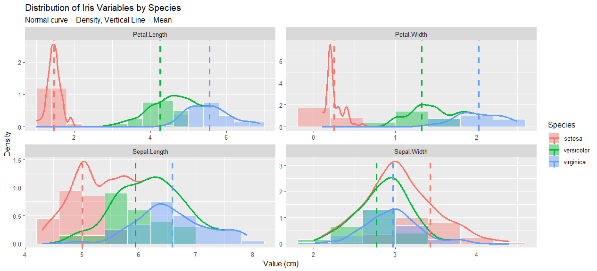

```{r setup, include=FALSE}
knitr::opts_chunk$set(echo = FALSE)
```

1.  Choose a Dataset

I chose Iris as my dataset

2.  Import the dataset into RStudio

I successfully imported my dataset into RStudio

3.  Create a Distribution Visualization

Here is an image of my distribution visualization:

[](LIS4317_mod7.png)

4.  Write a Blog Post

The name of the dataset I chose to use is Iris.

I used ggplot2 and the tidyverse to create a visual representation of the distribution of the iris dataset variables by species. The histogram visualization shows faceted distribution patterns for three iris species and their four variables (Petal.Length, Petal.Width, Sepal.Length, Sepal.Width) and adds a normal density curve along with a vertical line for the mean of each. Setosa consistently has the smallest Petal Length, Petal Width, and Sepal Length (according to the dashed lines representing the mean), with its distributions largely separate from the other two species and concentrated at lower values. Virginica generally has the largest Petal Width, Petal Length, and Sepal Length, and versicolor values for these first three graphs fall in between setosa and virginica. The pattern revealed by the visualization of the distributions is that the averages for the setosa are the least, with versicolor in the middle and then virginica with the most. Virginica does have the highest averages consecutively, except in the Sepal Width graph, where the versicolor average has the lowest values and the setosa average has the highest values. The data's distributions appear to follow a symmetrical pattern, with some outliers skewing the curve and the mean slightly to the right and the left.

My design choice of faceted overlapping histograms aligned with both Few and Yau's recommendations. It aligned with Yau's recommendations by following a faceted analytical display (small multiples) for showing a clear distribution design; "it encourages readers to make comparisons across groups and categories" (Yau, 2011, p. 221), and adding a density curve,"You need to use the density() function to estimate the points for the curve" (Yau, 2011, p. 209). According to Few (2009), "Displays that combine multiple views of a common data set on a single screen are called by different names. When they're used to make sense of the data,...I call them faceted analysis displays" (p. 107) and "histograms do a good job of displaying the overall shape of a distribution" (Few, 2009, p. 225). I used histograms to measure a continuous value variable and bars/lines to display the distributions. My visualization was able to clearly follow Few's recommendations for clear distribution design, as my visualization was able to include spread, center, and shape. In addition, I included scaled x and y axes, added meaningful color "RGB" to separate the Species, and displayed the data on a white grid on the background of the histogram.

I do agree with Few's critique on how distributions are commonly presented in visual analytics, especially when he mentions that the three most important characteristics to summarize distribution values visually are spread, center, and shape (Few, 2009, p. 216). I also found the different shapes of the distributions interesting in visual analytics.

References:

Few, S. (2009). Now you see it: simple visualization techniques for quantitative analysis. Analytics Press.

Yau, N. C. (2011). Visualize this: the flowing data guide to design, visualization, and statistics (1st edition). Wiley Publishing Inc.
