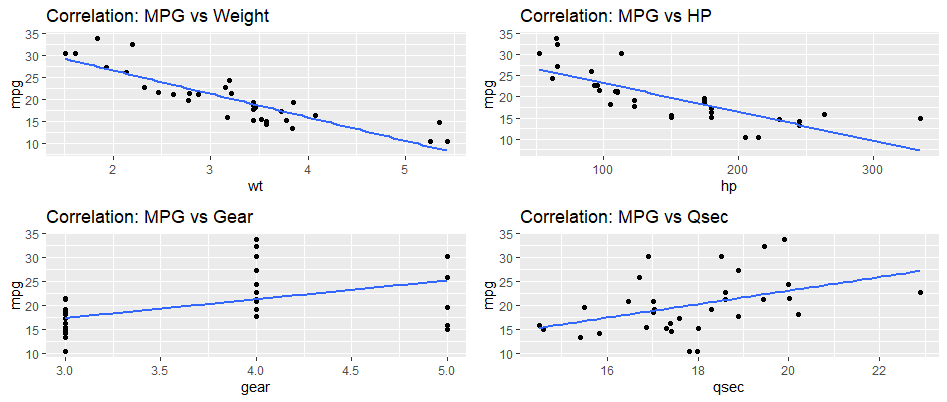

```{r setup, include=FALSE}
knitr::opts_chunk$set(echo = FALSE)
```

1.  Choose Your Dataset

I used mtcars as the dataset

2.  Import the Data into RStudio

I successfully imported the dataset into RStudio

3.  Conduct Correlation or Regression Analysis

4.  Create Your Visual in ggplot2

Here is an image of my distribution visualization:

[](corr.png)

5.  Reflect and share

I began by exploring the variable relationships using the cor() function to compute correlation matrices and the lm() function for linear regression models.

I then used ggplot2 and the gridExtra package to create a visual representation of multiple scatterplots to assess associations between the miles per gallon (mpg) variable and four other variables: Weight (wt), Horsepower (hp), Gear (gear), and Qsec (qsec), and added a regression line to show the predictive relationship between the variables.

I applied design suggestions from Few and Yau, including a grid layout for side-by-side comparison, labeling axes clearly, minimizing clutter, and using a neutral color scheme.

The analysis revealed several interesting patterns and relationships between the variables. First, there was a negative correlation between MPG and Weight, suggesting that heavier cars get lower MPG. Also, a negative correlation between MPG and Horsepower, suggesting that cars with more Horsepower get fewer MPG. Looking at the correlation between miles per gallon and gears, there is a slight positive correlation with substantial variance, suggesting that vehicles with more gears get better MPG. Finally, the positive correlation between MPG and Qsec suggests that slower vehicles with a higher quarter-mile time also may get better MPG; however, there is a lot of variance in the scatter plot chart around the regression line.

There are multiple concepts from Few and Yau that helped me with my design choices. Few (2009) highlights two best practices that I used in my scatter plots: "Removing fill color to reduce over-plotting" (p. 266) and "Using grid lines to enhance comparisons between scatterplots." (p. 266) If I used fill colors, there would be multiple regression lines interfering with other lines and cluttering points from a separate regression, and if I did not use grid lines, it would have been more challenging to estimate values. Few (2009) also suggests that "Comparing multiple scatterplots calls for a technique to make the comparison easier and more accurate." (p. 278) This led me to use grid lines to improve comparisons between scatterplots and display multiple scatterplots that each deal with comparing an mtcars input variable to the MPG output (dependent) variable. Finally, Yau (2011) talks about a "scatterplot matrix," which is "usually a square grid with all variables on both the vertical and horizontal." (p. 189) The concept of comparing variables using an x-axis and a y-axis is what gave me the idea to arrange plots, and having multiple independent variables in the dataset gave me the idea to use gridExtra to arrange multiple plots.

I used a gridExtra grid layout with two columns to place the four scatterplots in an organized manner. This helped place the scatterplots with negative correlation on top of the image and those with positive correlation at the bottom, making the visualization easier to understand. Yau (2011) suggests that "If two metrics are positively correlated, dots move higher up;" however, "if a negative correlation exists, the dots appear lower..." (p. 181) According to the data, Weight (wt) and Horsepower (hp) have a negative correlation to MPG due to a negative slope and most of the dots are below the regression line, while Gear (gear) and Qsec (qsec) have a positive correlation due to a positive slope and most of the dots are above the regression line.

References:

Few, S. (2009). Now you see it: simple visualization techniques for quantitative analysis. Analytics Press.

Yau, N. C. (2011). Visualize this: the flowing data guide to design, visualization, and statistics (1st edition). Wiley Publishing Inc.
