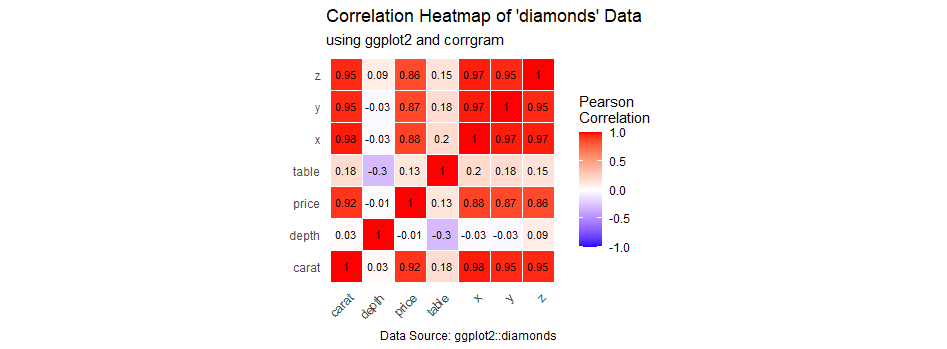

```{r setup, include=FALSE}
knitr::opts_chunk$set(echo = FALSE)
```

1.  Create a multivariate graph

Here is a png file of the correlation heatmap I created using ggplot2:

[](mod9vis.png)

2. Include a short write-up

Include a short write-up (1-2 paragraphs) that addresses:

Which dataset you used an why

I chose the 'diamonds' dataset from the ggplot2 library because it is structured with many diamond measurements and a lot of variables, which is great for a correlation matrix that is going to compare tons of values with one another.

What relationships or insights your visualization reveals.

I was able to visualize very interesting relationships between the variables. I noticed mostly positive correlations between the variables, some relationships that were not as significant, and a couple negative correlations. The correlation between diamond 'depth' and 'table' size appears to be negative, which tells me that as the total depth percentage of a diamond decreases, the width of the top of the diamond relative to the widest point also decreases. Also, I gained insight that the relationship between 'x', the length of the diamond in millimeters, and 'table' has a very low level of significance, which tells me that some values in the correlation may not be negative, but can have a very low occurrence by random chance.

Whether multivariate visualization was effective for this data.

It turns out multivariate visualization was effective for the 'diamonds' data because it helped to understand correlations that require more advanced statistics to be able to compute, and it helped to understand more complicated relationships, such as the relationship between 'depth' and diamond 'price', and the relationship between 'y', the width of the diamond in millimeters, and 'z', the depth in millimeters.

I have applied at least 3 of the design principles discussed in the module:

The first principle I used is Alignment. This allowed me to browse the variables that have been placed in a random or scattered orientation, and arrange them into a more ordered design, as well as aligning elements that are not in close adjacency with each other. My visualization was able to make the cells with a value of 1 go diagonal in order to get a more flexible glance at the distribution proportions, and I specified the correlation limits and midpoint in the ggplot() function while creating the Pearson Correlation legend.

The second principle I used is Repetition. This allowed me to bring independent elements that actually do share something in common together, and being able to associate the data properly. I used repetition when building a theme() function inside my geom_text() function as part of the ggplot2 heat map creation. After specifying the aes(), geom_tile(), and scale_fill_gradient() functions, I included the theme() function to repeat axis name arguments that each served different purposes: One was for the x text, another for x axis title, and a final one for the y axis title.

The third principle I used was Contrast. Contrast allowed me to emphasize the most important elements within my correlation heatmap so that the reader will know where they should look first or direct their eyes to the most important element. I utilized layer aesthetics when creating the ggplot heat map inside the ggplot() function. I started with the aes() functioon to include a fill equal to correlation that will allow the 'diamonds' cells to have color, then took advantage of setting the initial color of the tiles to white with the geom_tile() function to represent no value. Finally, to truly add color contrast to the correlation, I used the scale_fill_gradient() function to specify a color scheme that will show differences and relationships by color for each cell value that is from -1.0 to 1.0. Blue means low (negative), red means high (positive), and white now represents a neutral value (0) or midrange.


