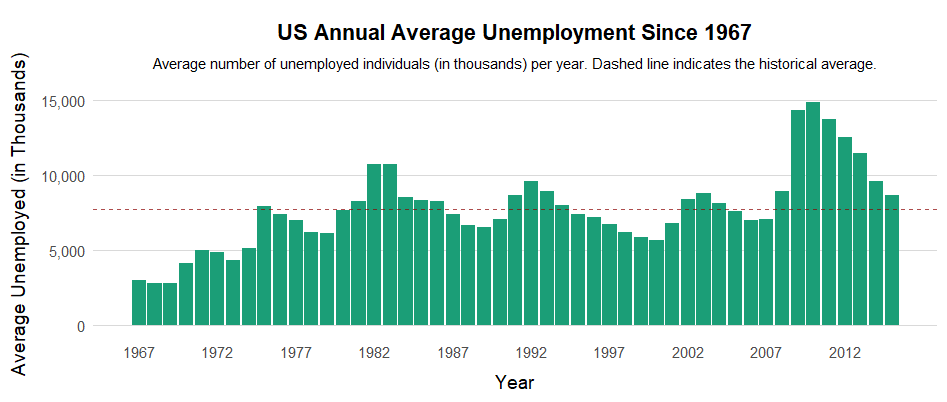

```{r setup, include=FALSE}
knitr::opts_chunk$set(echo = FALSE)
```

1.  Review the reading resources and post on your blog a new entry with your work with ggplot2 and time series (try yourself) and discuss the input of visualization on time series analysis.

Here is a png file of a bar graph time series visualization I created using ggplot2:

[](Mod10Vis.png)

The visualization above provides useful input for time series analysis. The bar graph style allowed me to instantly identify trend and cycles, levels, and changes. By plotting annual averages, the bar chart clearly shows a long term trend with an upward shift in total unemployment until late 2012, and economic cycles with multiple years. The height of the bars showed an absolute level of unemployment, emphasizing areas where the level changed drastically. While a line chart shows a short-term x-axis time series better, a bar chart of annual averages properly measures how much the unemployment rate changed year after year.

Before considering using a forecasting model like ARIMA, I wanted to use a simple visualization style to confirm assumptions about the data. One of these assumptions was stationarity, which I learned from one of the supplementary materials of this module. In the case of my visualization, the unemployment series is not stationary because the trend can shift upward or downward over the decades, which told me that I need to use differencing before starting to model. Another assumption is the model choice. Observing the patterns of peaks and troughs helped me out with the selection of model order.

Finally, it is easy to communicate my findings of this visualization. The simple, clean bar chart can help provide information to those who may not understand the mathematical models. Also, by including the title, axis labels, and the dashed line for the historical average, the bar chart immediately tells a story. The story in my case is that late 2008 unemployment peaked far above the historical average due to a financial crisis. The visualization easily supports the narrative that certain years represent significant, economic periods.


