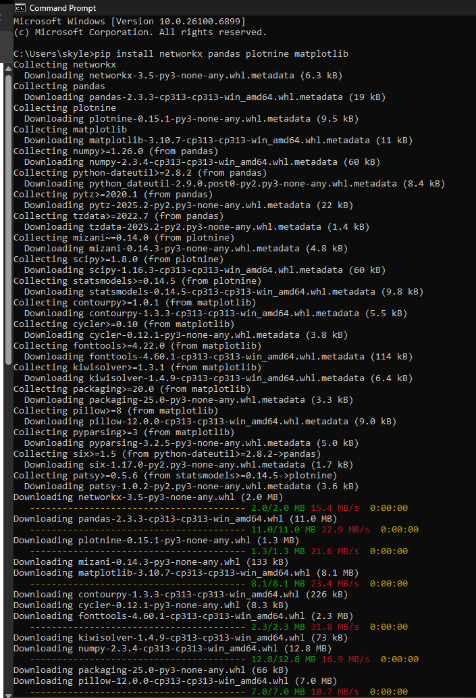

```{r setup, include=FALSE}
knitr::opts_chunk$set(echo = FALSE)
```

My assignment for module \# 12 is to create a basic Social Network Visualization using Python with networkx and plotnine (a ggplot2-style library in Python).

I installed the packages and followed the step-by-step directions provided in the assignment details.

[](mod12code.png)

Here is a screenshot of the graph that was generated:

[](mod12graph.png)

Reflecting on the process of completing the social network graph using plotnine, what worked well was writing and executing the Python file with a .py extension in Microsoft Visual Studio Code IDE. Also, installing the packages using the Windows Command Prompt terminal worked well.

[](cmdinstall.png)

I did encounter an error when I first attempted to install the packages in the Python Interactive Terminal:

[](error.png)

I also had to add an extra function to get the plot to display in a GUI window. I added the show() function to the network_plot object with the following line of code:

network_plot.show()

and the plot displayed nicely!

I would use this method again! I have experience with Pyton from both my highschool AP Computer Science course and my Introduction to Programming course here at USF. Python is a powerful open source programming language with many benefits, including the ability to create detailed plots from datasets similar to what we use in RStudio. I think it's cool that we can use ggplot2 functions in a Python script with the plotnine package.
